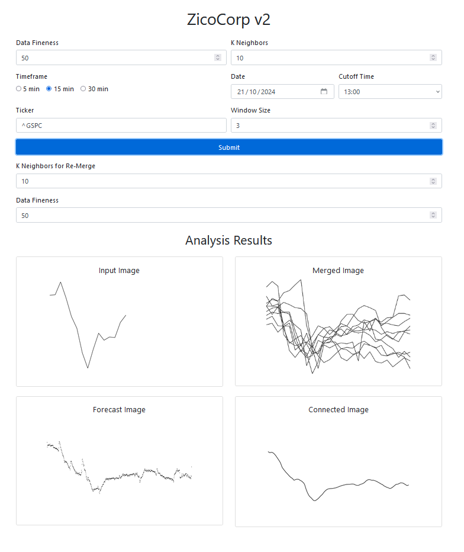

# Stock Market Prediction Platform

This project is a platform that uses Convolutional Neural Networks (CNN) models to predict the stock market chart for the current day. Predictions are based on 13 years of historical data. The platform is also built with HTML/CSS/JS/Bootstrap for the user interface and Python/Flask for the backend. Please note that the yfinance API is currently experiencing issues.

## Features

- Predicts the stock market chart for the current day.
- Uses CNN models trained on 13 years of data.
- Simple interface for visualizing prediction results.
